# miniCycle

**Turn Your Routine Into Progress**

A free, privacy-first routine manager with automatic task cycling, gamification, and offline support. Repeatable checklists that reset on completion — not one-and-done to-dos, not a daily habit tracker. Complete your routine, watch it reset, and track your cycles over time.

<p align="center">
  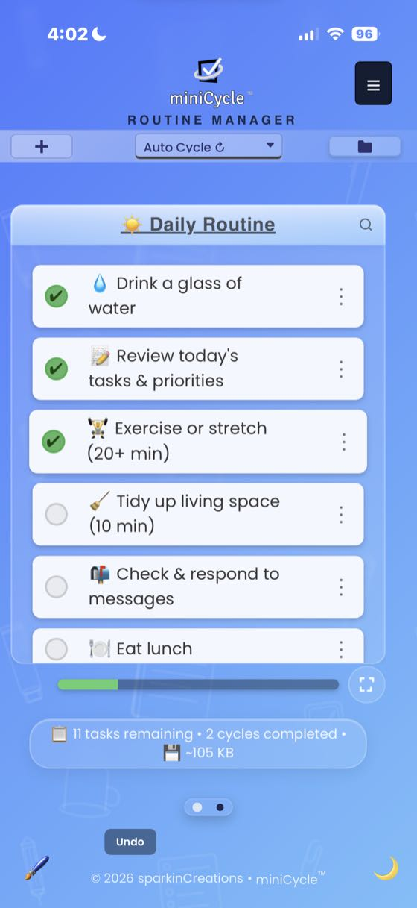
  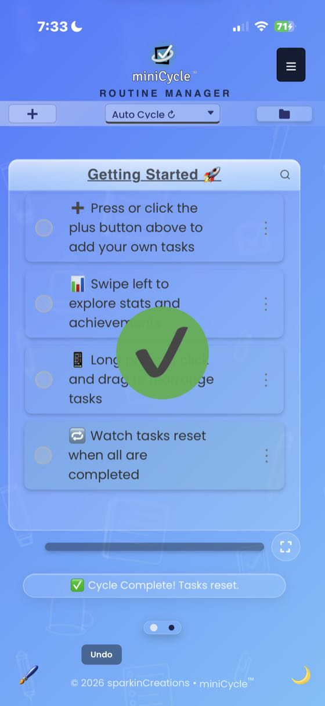
  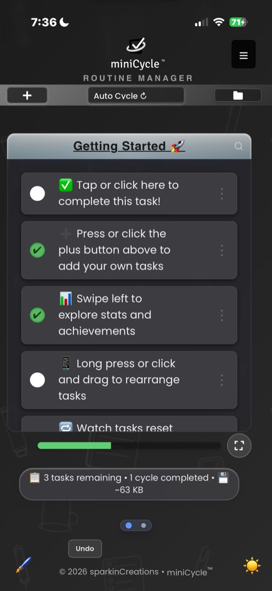
</p>

---

## Features

### Routine Cycling
The core mechanic — add your routine tasks, complete them all, and they automatically reset for the next cycle. Your cycle count tracks how many times you've completed your routine.

- **Auto Cycle Mode** — tasks reset automatically when all are completed
- **Manual Cycle Mode** — you decide when to reset
- **To-Do Mode** — completed tasks are removed instead of cycled (for one-off lists)

<p align="center">
  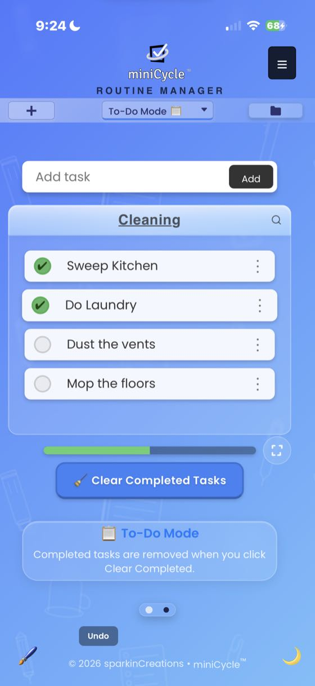
  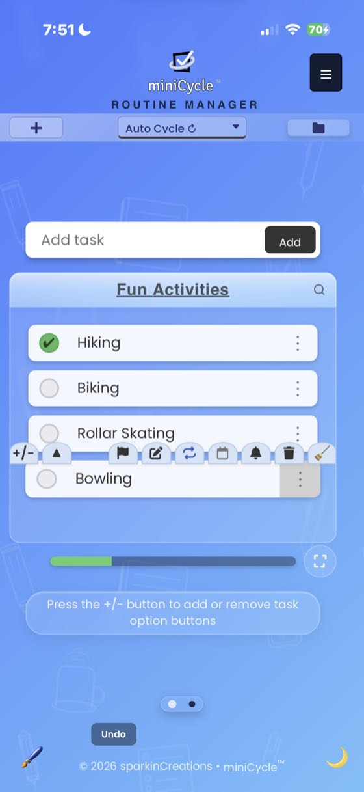
</p>

### Multiple Routines
Create and switch between separate routines — morning, workout, cooking, work, etc. Each routine has its own tasks, cycle count, stats, and theme.

- Search, sort, and filter your routine library
- Import/export routines as `.mcyc` files to share with others
- Per-routine storage size tracking

<p align="center">
  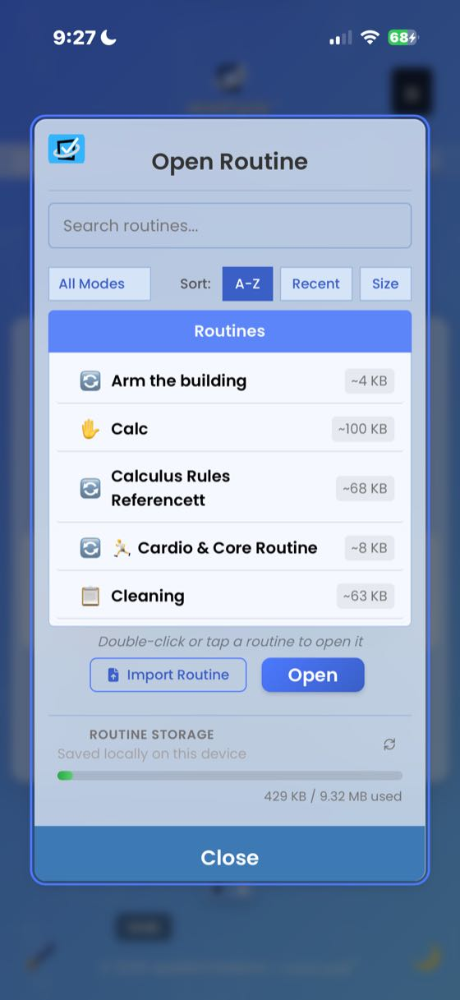
</p>

### Recurring Tasks & Due Dates
Schedule tasks to appear on a repeating basis — daily, weekly, monthly, or custom intervals. Set due dates with calendar picker for deadline tracking.

- Flexible frequency options with advanced scheduling (hourly, daily, weekly, biweekly, monthly, yearly, specific dates)
- Automatic activation when the next occurrence arrives
- Full management panel for all recurring tasks
- Due date badges with overdue highlighting

<p align="center">
  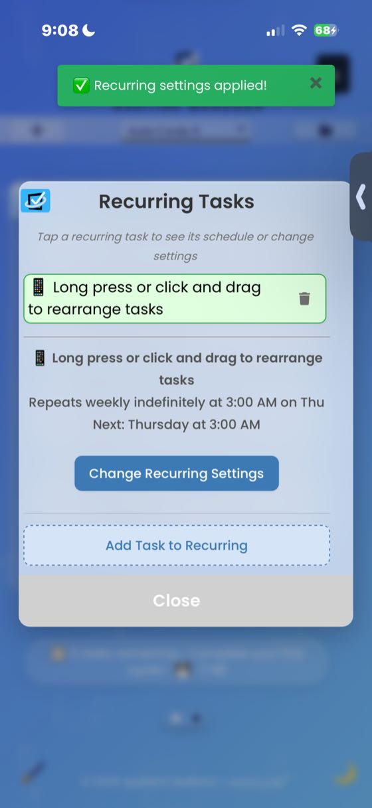
</p>

### Gamification
Stay motivated with achievements, milestones, unlockable themes, and a mini-game that reward consistency.

- **Achievement Badges** — unlock by reaching cycle and task milestones (5, 25, 50, 75, 100)
- **Milestone Celebrations** — overlay animations for major achievements
- **Progress Tracking** — see how close you are to the next unlock
- **Mini-Game** — Task Order unlocks at 100 cycles

<p align="center">
  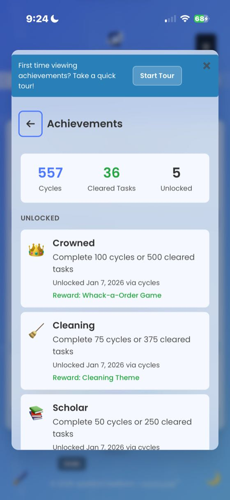
  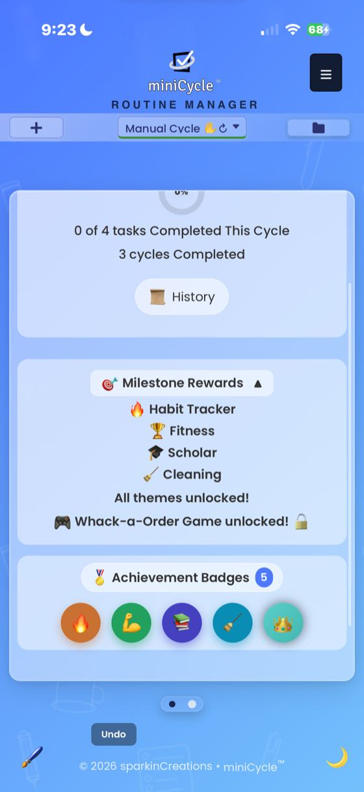
</p>

### Vocabulary Themes
Unlock 5 themes that transform a routine's language, icons, and color palette to match its context:

| Theme | Unlocks At | Example Vocabulary |
|-------|-----------|-------------------|
| Classic | Default | tasks, cycles, complete |
| Habit Tracker | 5 cycles | habits, streaks, check in |
| Fitness | 25 cycles | workouts, reps, finish set |
| Scholar | 50 cycles | studies, sessions, review |
| Cleaning | 75 cycles | chores, sweeps, clean up |

Each routine can use a different theme — your cooking routine can speak "Cleaning" while your study routine speaks "Scholar." Themes change both vocabulary and the entire color scheme.

<p align="center">
  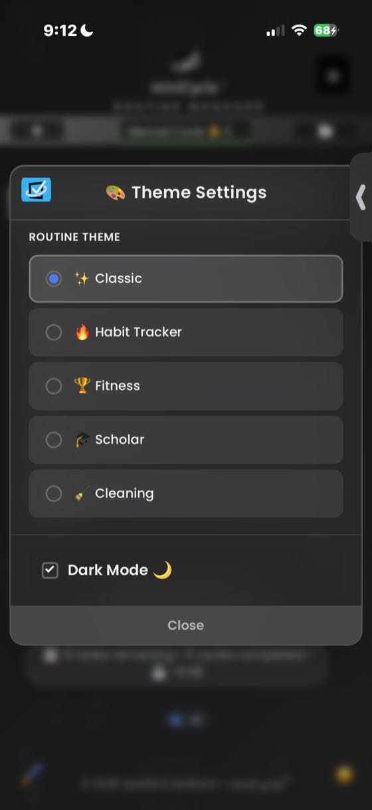
</p>

### Stats & History
Swipe left on the main view to access detailed statistics for your current routine.

- Completion percentage ring and cycle count
- Full cycle history log
- Cleared tasks archive with restore option

<p align="center">
  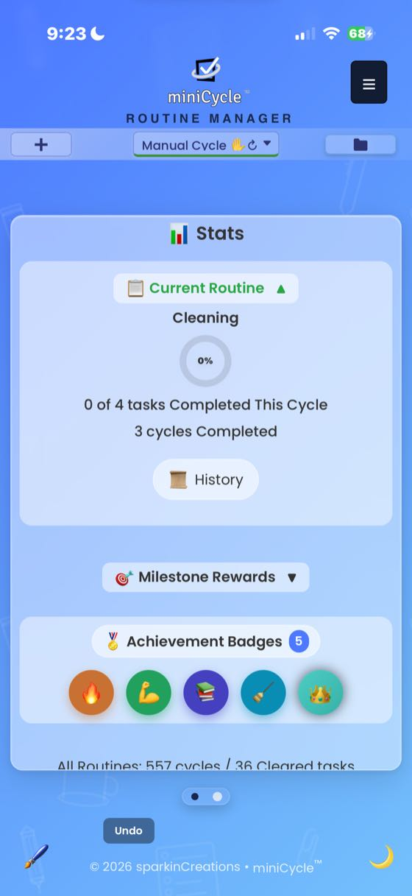
</p>

### Personalization
Customize colors, backgrounds, and display preferences to make miniCycle yours.

- Quick color themes and custom color picker
- Save, import, and export color presets
- Custom background images
- Dark mode (manual toggle or system-aware)
- Checkmark style options (fitted, minimal, circle)

<p align="center">
  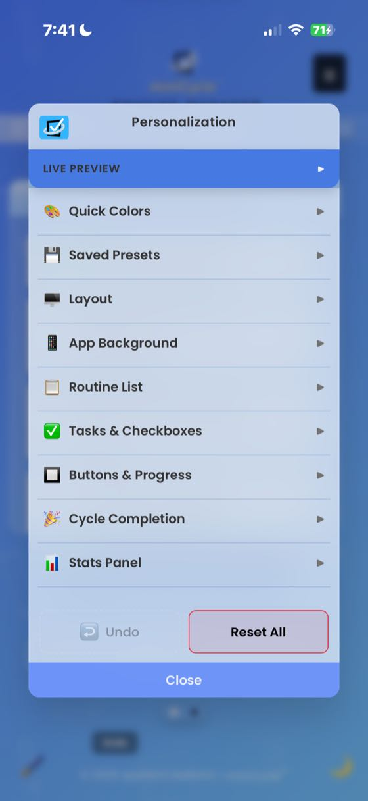
  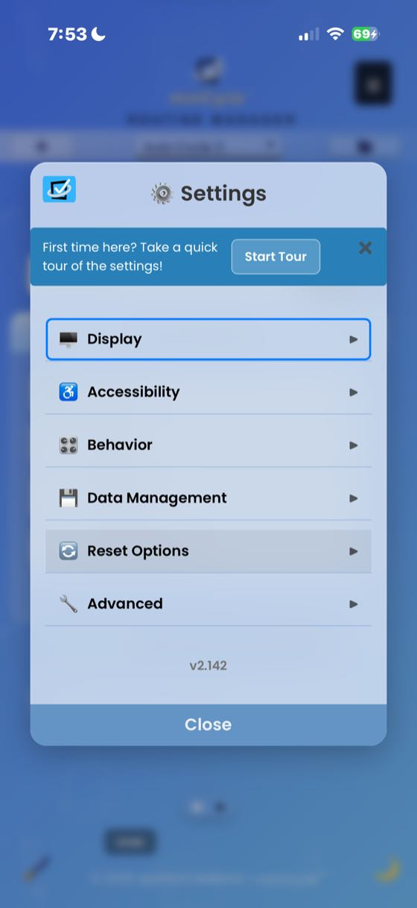
</p>

### Reminders & Notifications
Set per-task reminders with flexible scheduling — minutes, hours, or days — with optional browser notifications and due date alerts.

- Automatic backup reminders (every 14 days, 25 cycles, or 100 cleared tasks)
- Due date notifications for approaching deadlines

<p align="center">
  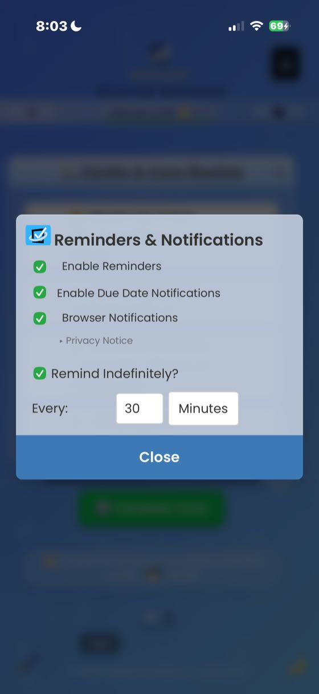
</p>

### Accessibility (WCAG AA)
- Reduced motion support (respects OS preference + manual toggle)
- High contrast mode
- Adjustable font sizes (Small, Default, Large, Extra Large)
- Full keyboard navigation and ARIA labels
- Focus management and focus trapping in modals
- Minimum 4.5:1 contrast ratios throughout

### More
- **Search & Filter** — filter by name, status, priority, due date, or recurring; sort by A-Z, priority, or due date
- **Drag & Drop** — reorder tasks by dragging or arrow buttons (custom Safari ghost)
- **Undo/Redo** — full undo history for task and cycle actions (Ctrl+Z / Cmd+Z)
- **Focus Mode** — distraction-free view hiding all navigation chrome
- **Guided Tours** — interactive walkthroughs for every major feature (13 tours total)
- **Quick Actions** — customizable fast-access toolbar in the hamburger menu
- **Sample Routines** — prebuilt routines (Daily Routine, Cardio, QA Inspection, etc.) to get started quickly
- **Offline Support** — works fully offline as a Progressive Web App
- **Backup & Restore** — full backup/restore of all routines and settings

<p align="center">
  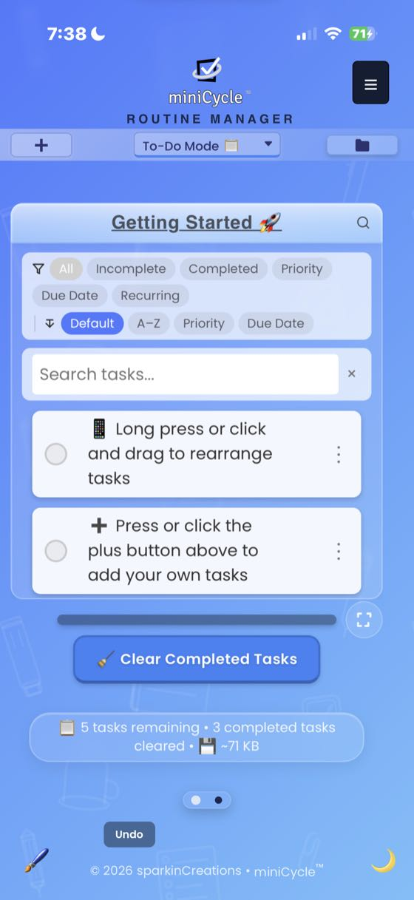
  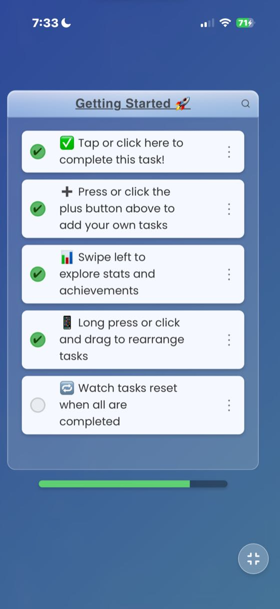
  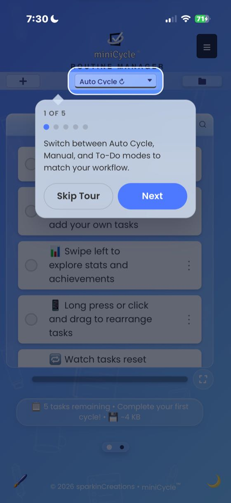
</p>

---

## Try It

**[minicycle.app](https://minicycle.app)** — works instantly in the browser, no account required.

### Install as an App
1. Visit [minicycle.app](https://minicycle.app) on any device
2. Look for "Install App" or "Add to Home Screen"
3. Use miniCycle as a native-like app with offline support

All data stays on your device. No servers, no accounts, no tracking.

---

## Why Vanilla JS?

miniCycle is built entirely with vanilla JavaScript — no React, no Vue, no framework. This is an intentional choice, not a limitation. Every architectural layer exists because a real problem demanded it, and building it by hand means every line is understood, not just imported.

### Philosophy

**Dependency Injection from scratch.** The app uses a custom DI framework (`diBase.js`) with `required()` and `optional()` dependency declarations, lazy getter resolution, and manifest-based wiring. This exists because the app's modules need to reference each other without circular imports or global state — the same problem Angular's DI solves, built here to understand how and why it works.

**A full label system instead of hardcoded strings.** Every user-facing string flows through `getLabel()` with pluralization, interpolation, and theme-aware resolution. This started as a way to keep text consistent and evolved into the foundation for the vocabulary theme system — where the entire app's language changes based on your routine's context.

**A 4-phase boot sequence.** `orchestrator → coreBoot → featureBoot → uiBoot` controls startup order so that state is ready before modules wire, modules wire before instances create, and instances create before the UI renders. This prevents an entire class of race conditions that plague large vanilla JS apps.

**Zero `window.*` globals.** Every dependency is explicitly injected. If a module needs `document.body`, it receives a `getBody()` helper through DI. This makes every module testable in isolation and makes the dependency graph fully visible.

The result is an app that solves the same problems frameworks solve — but with full visibility into every layer. The understanding paid off in both directions: miniCycle later gained an esbuild release pipeline (content-hashed bundles) without touching its architecture, and the studio's second app, [MasterMath](https://mastermath.app), ships on React + Vite — framework fluency and from-scratch depth, by way of the same codebase lessons.

---

## By the Numbers

All counts are floors — live numbers in [PROJECT_STATS.md](web/docs/PROJECT_STATS.md).

| Metric | Count |
|--------|-------|
| JavaScript | 90,000+ lines across 135+ modules |
| CSS | 22,000+ lines across 40+ token-based files |
| Automated Tests | 3,100+ browser tests in 125+ files (100% pass), plus offline-boot, layout, meta, and journey suites |
| Validation Gates | 9 — CSP hashes, HTML, docs links, DI declarations, legacy-read ratchet, inline-script contracts, comment references, ES built-in floor, label registries |
| DI-Manifested Modules | 55+ with 8 load phases |
| Label Keys | 1,600+ across 58 categories with theme-aware resolution |
| DOM Constants | 200+ (IDs, selectors, classes, z-index) |
| CSP Hashes | 20 SHA-256 inline script hashes |
| Guided Tours | 13 interactive walkthroughs |
| `window.*` Globals | 0 (strict DI enforcement) |

---

## Development

### Prerequisites
- Node.js (for test dependencies)
- Python 3 (for the dev server)

### Setup
```bash
git clone https://github.com/sparkinCreations/miniCycle.git
cd miniCycle/web
npm install
npm start        # HTTP server on localhost:8080
```

### Commands
```bash
npm start          # Python HTTP server on port 8080
npm test           # Playwright browser tests (server must be running)
npm run lint       # ESLint with security + SonarJS plugins
npm run perf       # Performance benchmarks
npm run lighthouse # Lighthouse CI audit
```

### Project Structure
```
miniCycle/
├── web/
│   ├── miniCycle.html              # Main entry point (PWA)
│   ├── service-worker.js           # Cache-first SW with version verification
│   ├── version.js                  # APP_VERSION + CACHE_VERSION (single source of truth)
│   ├── modules/                    # ES6 modules (strict DI, zero window.* globals)
│   │   ├── boot/                   # orchestrator → coreBoot → featureBoot → uiBoot
│   │   ├── core/                   # appState, appContext, diBase, constants
│   │   ├── task/                   # Task CRUD, rendering, drag-drop, search
│   │   ├── ui/                     # Modals, menus, settings, gestures, guided tours
│   │   ├── recurring/              # Scheduling, matching, panel, settings
│   │   ├── features/               # Themes, stats, achievements, history, reminders
│   │   ├── routine/                # Routine lifecycle, switching, import/export
│   │   ├── labels/                 # Label system + vocabulary theme overrides
│   │   ├── utils/                  # Notifications, device detection, validation
│   │   ├── storage/                # backupManager (IndexedDB)
│   │   ├── progress/               # Cycle completion tracking
│   │   └── other/                  # Plugin system
│   ├── styles/                     # Token-based CSS (variables.css foundation)
│   ├── tests/                      # Playwright browser tests (55 files)
│   ├── scripts/                    # build-chrome-full.cjs, build-android-www.cjs, tooling
│   └── docs/                       # Developer guides & architecture docs
├── chrome/                         # Chrome extension (MV3) — generated from web/ + hand-built lite popup
├── mobile/                         # Native mobile builds
│   ├── android/                    # Capacitor app — WebView shell over the byte-identical web app
│   └── ios/                        # Capacitor app (SPM-based) — same web payload, iOS shell
├── desktop/                        # Reserved for a future desktop build
├── shared/                         # Reserved for platform-agnostic logic (empty by design)
├── .github/workflows/              # CI pipelines (tests + Lighthouse + perf)
└── CLAUDE.md                       # Implementation rules & patterns
```

### Architecture

#### Dependency Injection
Every module declares its dependencies through `createDIModule()` from `diBase.js` with `required()` and `optional()` declarations. Dependencies are wired via manifest-based resolution in `featureBoot.js` — no circular imports, no global state, no `window.*` fallbacks. Lazy getter resolution ensures dependencies aren't evaluated until first access.

#### Boot Sequence
A 4-phase boot controls startup order with timeout protection:

```
orchestrator.js (sequence control + boot UI)
  → Phase 1: coreBoot.js     — AppState, GlobalUtils, migration (15s timeout)
  → Phase 2: featureBoot.js  — moduleLoader loads 51 manifests, wires ALL DI (20s timeout)
  → Phase 3: uiBoot.js       — event listeners, UI finalization
```

Modules load across 8 phases: Core Utils → Theme/Visual → Task Management → Recurring → Cycle → UI Managers → Features → Testing. Each module can declare `requires`, `optionalDeps`, and `lazyRequires` to control wiring order.

#### State Management
Centralized `AppState.update(producer)` is the single mutation entry point for all state changes. Schema 2.5 organizes data into `cycles`, `appState`, `settings`, `userProgress`, and `achievements`. Saves are debounced at 600ms by default, with immediate save option for critical operations. A full undo/redo system captures snapshots with deduplication and signature tracking.

#### Label System
Every user-facing string flows through `getLabel()` with pluralization, interpolation, and theme-aware resolution. The vocabulary theme system layers theme-specific overrides on top of the 53-category default label set. Themes are resolved per-routine, so different routines can display entirely different vocabulary simultaneously.

#### CSS Architecture
Token-based design system built on `variables.css` with semantic color palette, spacing scale, typography scale, and z-index layers. Dark mode uses CSS custom property overrides with a `prefers-color-scheme` media query fallback. Reduced motion support auto-disables transitions via `prefers-reduced-motion`. Vocabulary themes apply color presets as `--pref-*` CSS variables at runtime.

#### Service Worker
Cache-first navigation with a `verifyVersionFresh()` safety net that checks version.js after serving cached content. Handles Safari's `redirected: true` response rejection with a `cleanResponse()` helper. Release builds are fully content-hashed (`/build/[name]-[hash].js`, immutable caching) — the filename is the version, so stale-cache bugs are structurally impossible; `?v=` query versioning survives only in dev.

#### Security
- **CSP**: Strict Content Security Policy with 15+ SHA-256 hashes for inline scripts (no `'unsafe-inline'`)
- **XSS Prevention**: `textContent` for all user data, `innerHTML` only for trusted static content (icons, labels)
- **Headers**: HSTS (1 year), X-Frame-Options (SAMEORIGIN), X-Content-Type-Options (nosniff)
- **Permissions Policy**: Geolocation, microphone, camera, and payment APIs blocked
- **DOM Isolation**: All DOM access through DI helpers (`getElementById`, `querySelector`, `getBody`, etc.)

### CI/CD
GitHub Actions runs on every push and PR to main/develop:

- **Test Pipeline** (`test.yml`): Node.js 18.x + 20.x matrix — 3,100+ Playwright browser tests against Chromium, plus offline-boot/precache-drift, layout regression, test-suite meta guards, and end-to-end journey suites
- **Validation Gates** (`test.yml` + `performance.yml`): DI declarations, legacy-read ratchet, inline-script contracts, comment references, ES built-in floor, label registries, W3C HTML, docs links — all gated at zero; CSP hash coverage gates every release before push
- **Performance Pipeline** (`performance.yml`): Lighthouse CI audit + performance benchmarks
- **Linting**: ESLint with `eslint-plugin-security` and `eslint-plugin-sonarjs` under a one-way `--max-warnings` ratchet

### PWA Capabilities
- **Standalone display** with window controls overlay support
- **File handlers**: Opens `.mcyc` and `.json` files directly from the OS
- **Shortcuts**: Quick Add Task, Open Lite, User Manual
- **Offline**: Full functionality via service worker cache
- **Install prompts**: Automatic detection for iOS Safari, Chrome, Edge

### Browser Compatibility
- **Full app**: any browser with `globalThis` — Chrome 71+, Safari 12.1+, Firefox 65+, Edge (es2020 build target; a CI gate blocks newer built-ins from sneaking in)
- **Mobile**: iOS Safari, Android Chrome (full PWA support)
- **Legacy**: automatic feature-gate redirect to a static ES5 fallback in `lite/` for older devices

---

## License

This project is source-available under a proprietary license. You may view and study the code, but copying, modifying, distributing, or using it in other projects is not permitted. See [LICENSE](LICENSE) for full terms.

---

## About

miniCycle is developed by [sparkinCreations](https://sparkincreations.com).

- **App**: [minicycle.app](https://minicycle.app)
- **Website**: [sparkincreations.com](https://sparkincreations.com)
- **TaskCycle Demo**: [taskcycle.app](https://taskcycle.app) — a live demo of the upcoming full TaskCycle
- **Support**: [Open an issue](https://github.com/sparkinCreations/miniCycle/issues)
