# miniCycle

**Turn Your Routine Into Progress**

A free, privacy-first routine manager with automatic task cycling, gamification, and offline support. Build consistent habits by completing tasks, watching them reset, and tracking your growth over time.

<p align="center">
  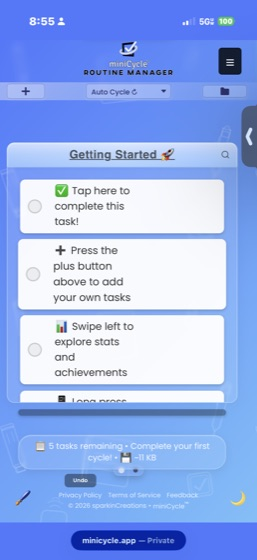
  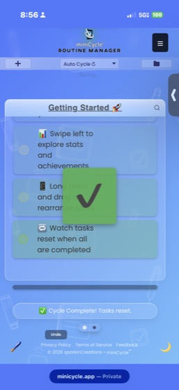
  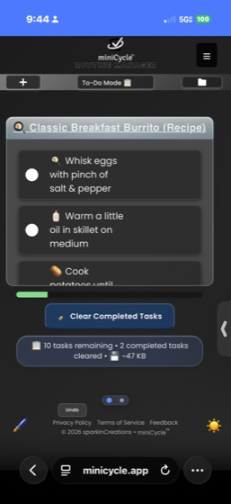
</p>

---

## Features

### Routine Cycling
The core mechanic — add your routine tasks, complete them all, and they automatically reset for the next cycle. Your cycle count tracks how many times you've completed your routine.

- **Auto Cycle Mode** — tasks reset automatically when all are completed
- **Manual Cycle Mode** — you decide when to reset
- **To-Do Mode** — completed tasks are removed instead of cycled (for one-off lists)

<p align="center">
  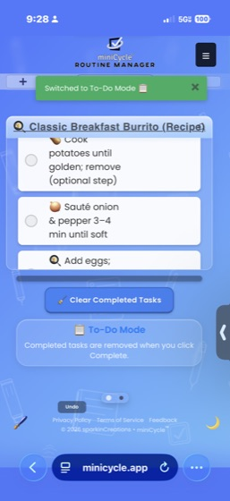
  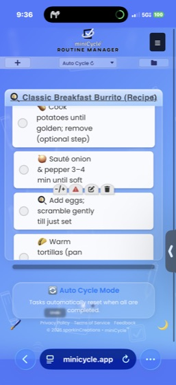
</p>

### Multiple Routines
Create and switch between separate routines — morning, workout, cooking, work, etc. Each routine has its own tasks, cycle count, stats, and theme.

- Search, sort, and filter your routine library
- Import/export routines as `.mcyc` files to share with others
- Per-routine storage size tracking

<p align="center">
  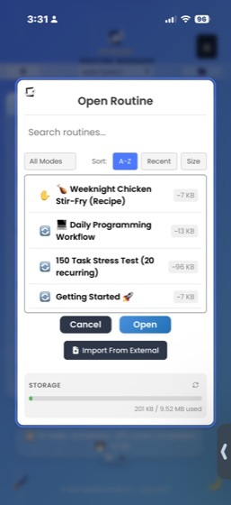
</p>

### Recurring Tasks
Schedule tasks to appear on a repeating basis — daily, weekly, monthly, or custom intervals.

- Flexible frequency options with advanced scheduling
- Automatic activation when the next occurrence arrives
- Full management panel for all recurring tasks

<p align="center">
  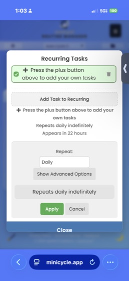
</p>

### Gamification
Stay motivated with achievements, milestones, and unlockable themes that reward consistency.

- **Achievement Badges** — unlock by reaching cycle and task milestones
- **Milestone Celebrations** — overlay animations for major achievements
- **Progress Tracking** — see how close you are to the next unlock

<p align="center">
  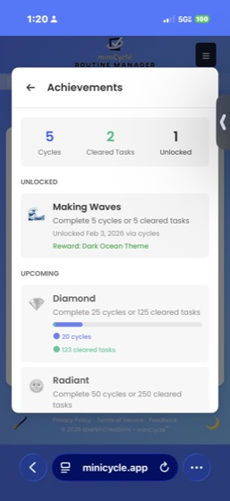
  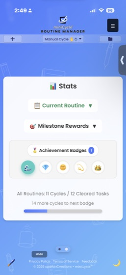
</p>

### Vocabulary Themes
Unlock 5 themes that change the app's language, icons, and colors to match your routine's context:

| Theme | Unlocks At | Example Vocabulary |
|-------|-----------|-------------------|
| Classic | Default | tasks, cycles, complete |
| Habit Tracker | 5 cycles | habits, streaks, check in |
| Fitness | 25 cycles | workouts, reps, finish set |
| Scholar | 50 cycles | studies, sessions, review |
| Cleaning | 75 cycles | chores, sweeps, clean up |

Each routine can use a different theme — your cooking routine can speak "Cleaning" while your study routine speaks "Scholar."

### Stats & History
Swipe left on the main view to access detailed statistics for your current routine.

- Completion percentage ring and cycle count
- Full cycle history log
- Cleared tasks archive with restore option

<p align="center">
  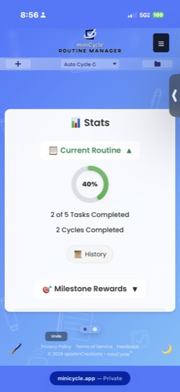
</p>

### Personalization
Customize colors, backgrounds, and display preferences to make miniCycle yours.

- Quick color themes and custom color picker
- Save, import, and export color presets
- Custom background images
- Dark mode (manual toggle or system-aware)
- Checkmark style options (fitted, minimal, circle)

<p align="center">
  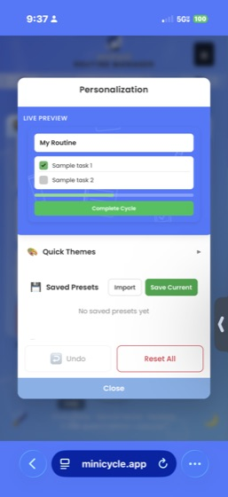
  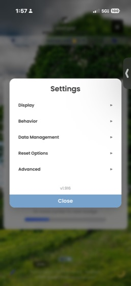
</p>

### Reminders & Notifications
Set per-task reminders with flexible scheduling — minutes, hours, or days — with optional browser notifications.

<p align="center">
  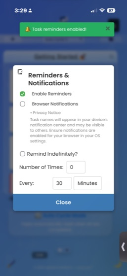
</p>

### Accessibility
- Reduced motion support (respects OS preference)
- High contrast mode
- Adjustable font sizes (4 options)
- Keyboard navigation and ARIA labels
- Focus management in modals

### More
- **Search** — filter tasks by name
- **Drag & Drop** — reorder tasks by dragging or arrow buttons
- **Undo/Redo** — full undo history for task and cycle actions
- **Focus Mode** — distraction-free view hiding navigation
- **Onboarding** — guided setup for new users
- **Quick Actions** — fast-access toolbar in the hamburger menu
- **Offline Support** — works fully offline via service worker

<p align="center">
  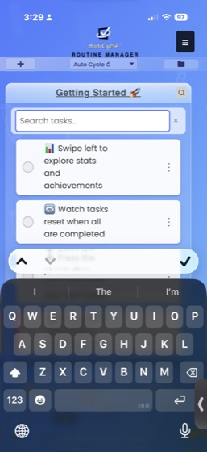
  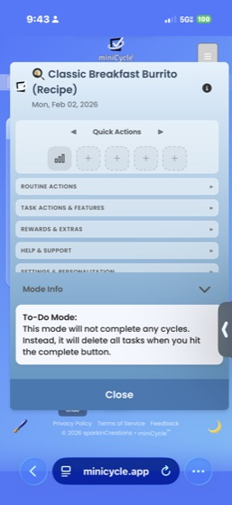
  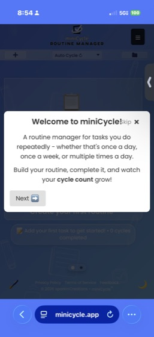
</p>

---

## Try It

**[minicycle.app](https://minicycle.app)** — works instantly in the browser, no account required.

### Install as an App
1. Visit [minicycle.app](https://minicycle.app) on any device
2. Look for "Install App" or "Add to Home Screen"
3. Use miniCycle as a native-like app with offline support

All data stays on your device. No servers, no accounts, no tracking.

---

## Why Vanilla JS?

miniCycle is built entirely with vanilla JavaScript — no React, no Vue, no framework. This is an intentional choice, not a limitation. Every architectural layer exists because a real problem demanded it, and building it by hand means every line is understood, not just imported.

### Philosophy

**Dependency Injection from scratch.** The app uses a custom DI framework (`diBase.js`) with `required()` and `optional()` dependency declarations, lazy getter resolution, and manifest-based wiring. This exists because 114 modules need to reference each other without circular imports or global state — the same problem Angular's DI solves, built here to understand how and why it works.

**A full label system instead of hardcoded strings.** Every user-facing string flows through `getLabel()` with pluralization, interpolation, and theme-aware resolution. This started as a way to keep text consistent and evolved into the foundation for the vocabulary theme system — where the entire app's language changes based on your routine's context.

**A 4-phase boot sequence.** `orchestrator → coreBoot → featureBoot → uiBoot` controls startup order so that state is ready before modules wire, modules wire before instances create, and instances create before the UI renders. This prevents an entire class of race conditions that plague large vanilla JS apps.

**Zero `window.*` globals.** Every dependency is explicitly injected. If a module needs `document.body`, it receives a `getBody()` helper through DI. This makes every module testable in isolation and makes the dependency graph fully visible.

The result is an app that solves the same problems frameworks solve — but with full visibility into every layer. The next project will use a build system and framework, informed by the deep understanding this one provided.

---

## Development

### Prerequisites
- Node.js (for test dependencies)
- Python 3 (for the dev server)

### Setup
```bash
git clone https://github.com/sparkinCreations/miniCycle.git
cd miniCycle/web
npm install
npm start        # HTTP server on localhost:8080
```

### Commands
```bash
npm start          # Python HTTP server on port 8080
npm test           # Playwright browser tests (server must be running)
npm run lint       # ESLint with security + SonarJS plugins
```

### Project Structure
```
miniCycle/
├── web/
│   ├── miniCycle.html              # Main entry point (PWA)
│   ├── service-worker.js           # Offline support & caching
│   ├── version.js                  # APP_VERSION + CACHE_VERSION
│   ├── modules/                    # 114 ES6 modules (strict DI)
│   │   ├── boot/                   # orchestrator → coreBoot → featureBoot → uiBoot
│   │   ├── core/                   # appState, appContext, diBase, constants
│   │   ├── task/                   # Task CRUD, rendering, drag-drop, search
│   │   ├── ui/                     # Modals, menus, settings, gestures, undo
│   │   ├── recurring/              # 15 files — scheduling, matching, panel
│   │   ├── features/               # Themes, stats, achievements, history, reminders
│   │   ├── routine/                # Routine lifecycle, switching, import/export
│   │   ├── labels/                 # Label system (~1,050 keys) + theme overrides
│   │   ├── utils/                  # Notifications, device detection, validation
│   │   ├── storage/                # backupManager (IndexedDB)
│   │   ├── progress/               # Cycle completion tracking
│   │   └── other/                  # Plugin system
│   ├── styles/                     # 38 CSS files, token-based (variables.css)
│   ├── tests/                      # 59 Playwright test files
│   └── docs/                       # Developer guides & architecture docs
├── lite/                           # Static ES5 fallback (frozen, not maintained)
└── CLAUDE.md                       # Implementation rules & patterns
```

### Architecture
- **114 ES6 modules** with strict dependency injection — zero `window.*` globals
- **Boot sequence**: orchestrator → coreBoot → featureBoot → uiBoot
- **State management**: centralized `AppState.update(producer)` with Schema 2.5
- **Label system**: ~1,050 keys with pluralization, interpolation, and theme-aware resolution
- **CSS**: token-based design system with 38 files, dark mode, reduced motion support
- **Service worker**: network-first strategy with stale-while-revalidate fallback
- **Security**: Content Security Policy with hash-based inline script validation, XSS-safe DOM patterns

### Browser Compatibility
- **Modern**: Chrome, Firefox, Safari, Edge (ES6+)
- **Mobile**: iOS Safari, Android Chrome (full PWA support)
- **Legacy**: Static ES5 fallback in `lite/` for older devices

---

## Contributing

1. Fork the repository
2. Create a feature branch: `git checkout -b feature-name`
3. Follow the patterns documented in `CLAUDE.md`
4. Run `npm run lint` and `npm test` to verify
5. Submit a pull request

---

## License

MIT License — see [LICENSE](LICENSE) for details.

---

## About

miniCycle is developed by [sparkinCreations](https://sparkincreations.com).

- **App**: [minicycle.app](https://minicycle.app)
- **Website**: [sparkincreations.com](https://sparkincreations.com)
- **TaskCycle Pro**: [taskcycle.app](https://taskcycle.app)
- **Support**: [Open an issue](https://github.com/sparkinCreations/miniCycle/issues)
