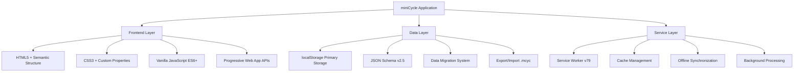

# miniCycle - Developer Documentation

**Version**: 1.306  
**Last Updated**: October 2025  
**Target Audience**: Developers, Contributors, Technical Partners  
**Purpose**: Comprehensive technical guide reflecting current implemented features

---

## Table of Contents

1. [Executive Summary](#executive-summary)
2. [Architecture Overview](#architecture-overview)
3. [Core Features](#core-features)
4. [Technical Implementation](#technical-implementation)
5. [API Reference](#api-reference)
6. [Development Setup](#development-setup)
7. [Deployment Guide](#deployment-guide)
8. [Troubleshooting](#troubleshooting)

---

## Executive Summary

miniCycle is a **progressive web application** that revolutionizes task management through the concept of "cycling" - automatic task reset functionality that promotes habit formation and routine establishment. Built with pure vanilla JavaScript, it prioritizes privacy, performance, and accessibility.

### Key Differentiators

- **🔄 Cycling Methodology**: Tasks reset automatically to encourage routine building
- **🔒 Privacy-First**: 100% client-side with zero data transmission
- **📱 Progressive Web App**: Full offline functionality with service worker
- **🎯 Dual-Mode Architecture**: Full and lite versions for maximum compatibility
- **🧩 Modular Design**: Clean separation of concerns with ES6 modules

### Current Status

- **Production Ready**: Deployed and actively maintained
- **Schema Version**: 2.5 with automatic migration
- **Browser Support**: Modern browsers + ES5 fallback
- **Performance**: ~13K lines, modular loading, optimized caching

---

## Architecture Overview

### Technology Stack



### Project Structure

```
miniCycle/
├── 📄 Core Application
│   ├── miniCycle.html              # Main app entry point
│   ├── miniCycle-scripts.js        # Core application logic (13K+ lines)
│   ├── miniCycle-styles.css        # Main stylesheet
│   └── service-worker.js           # PWA service worker
│
├── 🧩 Modular System
│   ├── utilities/
│   │   ├── notifications.js        # Advanced notification system
│   │   ├── statsPanel.js          # Statistics & swipe navigation
│   │   ├── state.js               # State management with undo/redo
│   │   ├── cycleLoader.js         # Data loading & migration
│   │   ├── deviceDetection.js    # Platform-specific features
│   │   ├── themeManager.js       # Theme system & unlocks
│   │   ├── globalUtils.js        # Shared utilities
│   │   └── testing-modal.js      # Development & debugging tools
│   │
├── 📱 Compatibility Layer
│   ├── miniCycle-lite.html        # ES5 compatible version
│   ├── miniCycle-lite-scripts.js  # Legacy browser support
│   └── miniCycle-lite-styles.css  # Optimized styles
│
├── 🎨 Assets & Resources
│   ├── assets/
│   │   ├── images/logo/           # Branding assets
│   │   ├── images/screenshots/    # PWA store assets
│   │   └── videos/samples/        # Demo content
│   │
├── 📚 Documentation & Support
│   ├── docs/                      # Developer documentation
│   ├── user-manual.html          # End-user guide
│   ├── product.html              # Marketing landing page
│   ├── privacy.html              # Privacy policy
│   └── terms.html                # Terms of service
│
├── 🔧 Development Tools
│   ├── backup/                   # Automated version backups
│   ├── update-version.sh         # Version management script
│   └── netlify.toml              # Deployment configuration
│
└── 📊 Data & Configuration
    ├── manifest.json             # PWA manifest (full version)
    ├── manifest-lite.json        # PWA manifest (lite version)
    ├── data/*.mcyc              # Sample cycle files
    └── robots.txt               # SEO configuration
```

---

## Core Features

### 🔄 Task Cycling System

**Core Concept**: Unlike traditional task managers, miniCycle automatically resets completed task lists to promote habit formation.

```javascript
// Example: Auto-reset when all tasks completed
function checkForAutoReset() {
    const allTasks = getCurrentCycleTasks();
    const completedTasks = allTasks.filter(task => task.completed);
    
    if (allTasks.length > 0 && completedTasks.length === allTasks.length) {
        if (isAutoResetEnabled()) {
            resetCycle();
            incrementCycleCount();
            showNotification('🎉 Cycle completed! Starting fresh.', 'success');
        }
    }
}
```

### 📊 Progressive Statistics

- **Real-time Progress Tracking**: Live completion rates and cycle counts
- **Milestone Badges**: Unlockable achievements at 5, 25, 50, 75, 100 cycles
- **Theme Rewards**: New visual themes unlocked through usage
- **Swipe Navigation**: Touch-optimized stats panel with gesture support

### 🔁 Advanced Recurring Tasks

**Supported Frequencies:**
- Hourly (with specific minute selection)
- Daily (with specific time selection)
- Weekly (with day selection)
- Biweekly (every two weeks)
- Monthly (with date selection)
- Yearly (with month/date selection)

**Advanced Options:**
- Specific date selection
- Time-based scheduling
- Indefinite or limited recurrence
- Pattern-based repetition

### 🧩 Modular Architecture

**ES6 Module System:**
```javascript
// Example module import
import { MiniCycleNotifications } from './utilities/notifications.js';
import { StatsPanelManager } from './utilities/statsPanel.js';

// Initialize with dependency injection
const notifications = new MiniCycleNotifications();
const statsPanel = new StatsPanelManager({
    showNotification: notifications.show.bind(notifications)
});
```

### 🎨 Dynamic Theming

**Unlockable Theme System:**
- Default themes available immediately
- **Dark Ocean**: Unlocked at 5 cycles
- **Golden Glow**: Unlocked at 50 cycles
- Custom color schemes with CSS custom properties

### 📱 Progressive Web App

**PWA Features:**
- **Offline Functionality**: Full app works without internet
- **Installation**: Add to home screen on mobile/desktop
- **Background Sync**: Service worker handles updates
- **App Shortcuts**: Quick actions from launcher
- **Responsive Design**: Optimized for all screen sizes

---

## Technical Implementation

### Data Schema (Version 2.5)

```typescript
interface MiniCycleData {
    schemaVersion: 2.5;
    metadata: {
        lastModified: number;
        appVersion: string;
        migrationHistory: string[];
    };
    cycles: {
        [cycleId: string]: {
            name: string;
            tasks: Task[];
            cycleCount: number;
            autoReset: boolean;
            deleteCheckedTasks: boolean;
            settings: CycleSettings;
        };
    };
    appState: {
        activeCycleId: string;
        currentMode: 'auto-cycle' | 'manual-cycle' | 'todo-mode';
    };
    settings: {
        globalSettings: GlobalSettings;
        unlockedThemes: string[];
        unlockedFeatures: string[];
        dismissedEducationalTips: Record<string, boolean>;
        notificationPosition: { x: number; y: number };
        defaultRecurringSettings: RecurringSettings;
    };
}

interface Task {
    id: string;
    text: string;
    completed: boolean;
    highPriority: boolean;
    dueDate: string | null;
    remindersEnabled: boolean;
    recurring: boolean;
    recurringSettings: RecurringSettings;
    schemaVersion: 2.5;
    createdAt: string;
    completedAt: string | null;
}
```

### State Management System

**Centralized State with Undo/Redo:**
```javascript
// utilities/state.js
class MiniCycleState {
    constructor() {
        this.data = null;
        this.undoStack = [];
        this.redoStack = [];
        this.listeners = new Map();
    }
    
    // Capture state snapshots for undo functionality
    captureSnapshot(description) {
        const snapshot = {
            data: structuredClone(this.data),
            timestamp: Date.now(),
            description
        };
        this.undoStack.push(snapshot);
        this.redoStack = []; // Clear redo stack
    }
    
    // Restore previous state
    undo() {
        if (this.undoStack.length === 0) return false;
        
        const currentSnapshot = {
            data: structuredClone(this.data),
            timestamp: Date.now(),
            description: 'Before undo'
        };
        this.redoStack.push(currentSnapshot);
        
        const previousSnapshot = this.undoStack.pop();
        this.data = previousSnapshot.data;
        this.save();
        this.notifyListeners('undo', previousSnapshot);
        
        return true;
    }
}
```

### Service Worker Implementation

**Cache-First Strategy with Update Management:**
```javascript
// service-worker.js
const CACHE_VERSION = 'v79';
const APP_VERSION = '1.306';

// Install: Cache core resources
self.addEventListener('install', (event) => {
    event.waitUntil(
        caches.open(STATIC_CACHE)
            .then(cache => cache.addAll([
                './',
                './miniCycle.html',
                './miniCycle-scripts.js',
                './miniCycle-styles.css',
                './utilities/notifications.js',
                './utilities/statsPanel.js'
            ]))
    );
});

// Fetch: Serve from cache, fallback to network
self.addEventListener('fetch', (event) => {
    event.respondWith(
        caches.match(event.request)
            .then(response => response || fetch(event.request))
    );
});
```

### Notification System

**Advanced Notification Management:**
```javascript
// utilities/notifications.js
export class MiniCycleNotifications {
    constructor() {
        this.educationalTips = new EducationalTipManager();
        this.isDraggingNotification = false;
    }
    
    show(message, type = 'default', duration = null) {
        // Create notification with auto-remove and hover pause
        const notification = this.createNotificationElement(message, type);
        this.setupDragSupport(notification);
        
        if (duration) {
            this.setupAutoRemove(notification, duration);
        }
        
        return notification;
    }
    
    // Draggable notifications with position persistence
    setupDragSupport(container) {
        // Touch and mouse drag support
        // Saves position to localStorage
    }
}
```

---

## API Reference

### Core Functions

#### Task Management

```javascript
// Add new task
addTask(taskText, options = {})
→ Returns: Task object

// Complete task
completeTask(taskId)
→ Returns: boolean

// Delete task
deleteTask(taskId)
→ Returns: boolean

// Reorder tasks
reorderTasks(sourceIndex, targetIndex)
→ Returns: boolean
```

#### Cycle Management

```javascript
// Create new cycle
createNewCycle(cycleName)
→ Returns: Cycle object

// Switch active cycle
switchToCycle(cycleId)
→ Returns: boolean

// Export cycle
exportCycle(cycleId, format = 'mcyc')
→ Returns: Blob

// Import cycle
importCycle(fileData)
→ Returns: Promise<Cycle>
```

#### Recurring Tasks

```javascript
// Apply recurring settings
applyRecurringToTask(taskId, recurringSettings)
→ Returns: boolean

// Check for due recurring tasks
checkRecurringTasks()
→ Returns: Task[]

// Generate next occurrence
generateNextOccurrence(task)
→ Returns: Date
```

### Module APIs

#### Notifications Module

```javascript
import { MiniCycleNotifications } from './utilities/notifications.js';

const notifications = new MiniCycleNotifications();

// Show notification
notifications.show(message, type, duration);

// Show with educational tip
notifications.showWithTip(content, type, duration, tipId);

// Show confirmation modal
notifications.showConfirmationModal({
    title: 'Confirm Action',
    message: 'Are you sure?',
    callback: (confirmed) => { /* handle result */ }
});
```

#### Stats Panel Module

```javascript
import { StatsPanelManager } from './utilities/statsPanel.js';

const statsPanel = new StatsPanelManager({
    showNotification: notifications.show,
    loadMiniCycleData: window.loadMiniCycleData
});

// Update statistics
statsPanel.updateStatsPanel();

// Show/hide panels
statsPanel.showStatsPanel();
statsPanel.showTaskView();
```

#### State Management Module

```javascript
import { MiniCycleState } from './utilities/state.js';

const state = new MiniCycleState();

// Initialize with data
await state.init();

// Subscribe to changes
state.subscribe('taskUpdate', (data) => {
    console.log('Tasks updated:', data);
});

// Undo/Redo operations
state.undo();
state.redo();
```

---

## Development Setup

### Prerequisites

- **Node.js**: For blog build system (optional)
- **Modern Browser**: Chrome, Firefox, Safari, or Edge
- **HTTP Server**: Python, Node.js, or any static server

### Quick Start

1. **Clone/Download Project**
   ```bash
   # No build process required - it's vanilla JavaScript!
   cd miniCycle/web
   ```

2. **Start Local Server**
   ```bash
   # Option 1: Python (recommended)
   python3 -m http.server 8080
   
   # Option 2: Node.js
   npx serve .
   
   # Option 3: Any static file server
   ```

3. **Access Application**
   - **Full Version**: http://localhost:8080/miniCycle.html
   - **Lite Version**: http://localhost:8080/miniCycle-lite.html

### Development Workflow

1. **Make Changes**: Edit HTML, CSS, or JavaScript files directly
2. **Test Locally**: Refresh browser to see changes
3. **Version Update**: Run `./update-version.sh` for releases
4. **Validate**: Use built-in testing modal for diagnostics

### Blog Development (Optional)

```bash
cd blog
npm install
npm run build  # Generates static blog files
```

---

## Deployment Guide

### Static Hosting (Recommended)

**Compatible Platforms:**
- Netlify ✅ (includes `netlify.toml` config)
- Vercel ✅
- GitHub Pages ✅
- Any static hosting service ✅

### Netlify Deployment

```toml
# netlify.toml (included)
[build]
  publish = "."

[[redirects]]
  from = "/*"
  to = "/miniCycle.html"
  status = 200
  conditions = {Role = ["admin"]}

[build.environment]
  NODE_VERSION = "18"
```

### Manual Deployment

1. **Upload Files**: Copy entire project directory
2. **Configure Server**: Ensure proper MIME types for `.mcyc` files
3. **HTTPS Required**: PWA features require secure context
4. **Cache Headers**: Configure for optimal performance

### Version Management

```bash
# Update version numbers across all files
./update-version.sh

# Follow prompts for:
# - App version (e.g., 1.307)
# - Service Worker version (e.g., v80)

# Creates automatic backups in backup/ directory
```

---

## Troubleshooting

### Common Issues

#### 1. **Stats Panel Not Updating**
**Problem**: Stats show zeros when loading saved sessions  
**Solution**: Fixed in v1.306 - stats now update immediately on data load  
**Implementation**: Added data-ready event listeners to stats panel

#### 2. **Service Worker Update Issues**
**Problem**: App doesn't show update prompts  
**Solution**: Check service worker registration and cache versions  
```javascript
// Manual update check
window.checkForUpdates();

// Force service worker update
window.forceServiceWorkerUpdate();
```

#### 3. **Data Migration Problems**
**Problem**: Data corruption during schema upgrades  
**Solution**: Built-in migration system with backup recovery  
```javascript
// Check migration status
window.checkMigrationStatus();

// Restore from backup if needed
window.restoreFromBackup(backupId);
```

#### 4. **Performance Issues**
**Problem**: Slow loading or laggy interactions  
**Solution**: Check browser compatibility and enable lite version  
```javascript
// Force lite version for older devices
localStorage.setItem('miniCycleForceFullVersion', 'false');
location.reload();
```

### Debugging Tools

#### Built-in Testing Modal
- **Access**: Settings → App Diagnostics & Testing
- **Features**: Health checks, data analysis, migration tools
- **Debug Info**: Browser capabilities, feature flags, localStorage

#### Console Commands
```javascript
// Global debug functions
window.getServiceWorkerInfo()  // Service worker status
window.generateDebugReport()   // Comprehensive system info
window.checkDataIntegrity()    // Validate data structure
window.exportDebugData()       // Export debug package
```

#### Version Information
```javascript
// Check current versions
console.log('App Version:', document.querySelector('meta[name="app-version"]')?.content);
console.log('SW Version:', await window.getServiceWorkerVersion());
console.log('Schema Version:', window.getCurrentSchemaVersion());
```

### Performance Optimization

#### Recommendations
1. **Enable Service Worker**: Automatic caching and offline support
2. **Use Appropriate Version**: Lite version for older devices
3. **Regular Cleanup**: Clear old data and notifications
4. **Monitor Memory**: Large task lists may impact performance

#### Metrics to Monitor
- Task count per cycle (recommended: <100)
- Total cycles (impacts loading time)
- localStorage usage (browser limits apply)
- Service worker cache size

---

## Contributing

### Code Style
- **Vanilla JavaScript**: No external dependencies
- **ES6+ Features**: With ES5 fallback support
- **Modular Design**: Separate concerns into utilities
- **Comprehensive Comments**: Document complex logic

### Testing
- Use built-in testing modal for validation
- Test both full and lite versions
- Verify PWA functionality offline
- Check responsive design on multiple devices

### Pull Request Guidelines
1. Update version numbers using `update-version.sh`
2. Test on multiple browsers
3. Update documentation if needed
4. Include performance impact assessment

---

**Documentation Version**: 1.306  
**Last Updated**: October 2025  
**Maintained By**: sparkinCreations Development Team