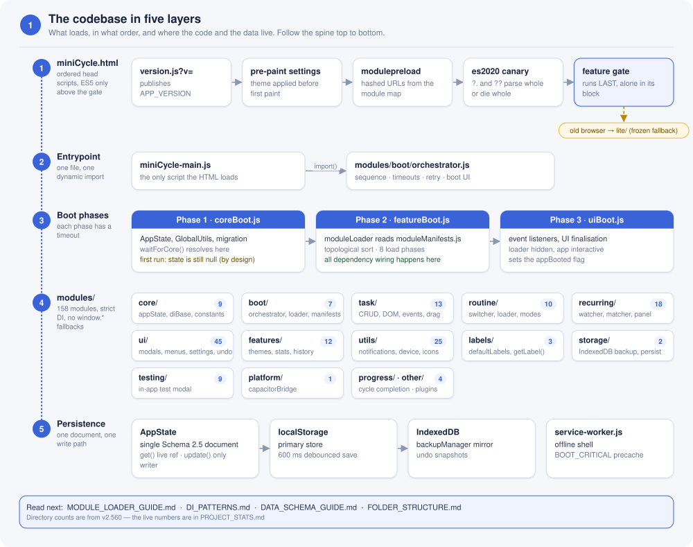
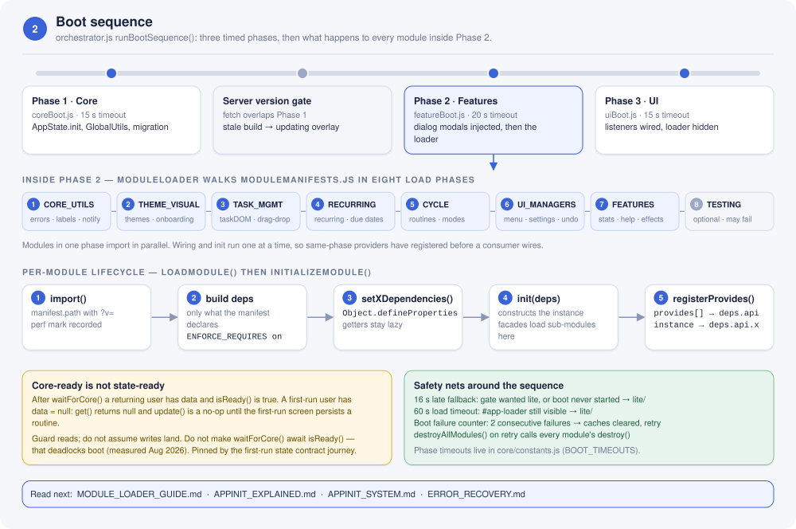
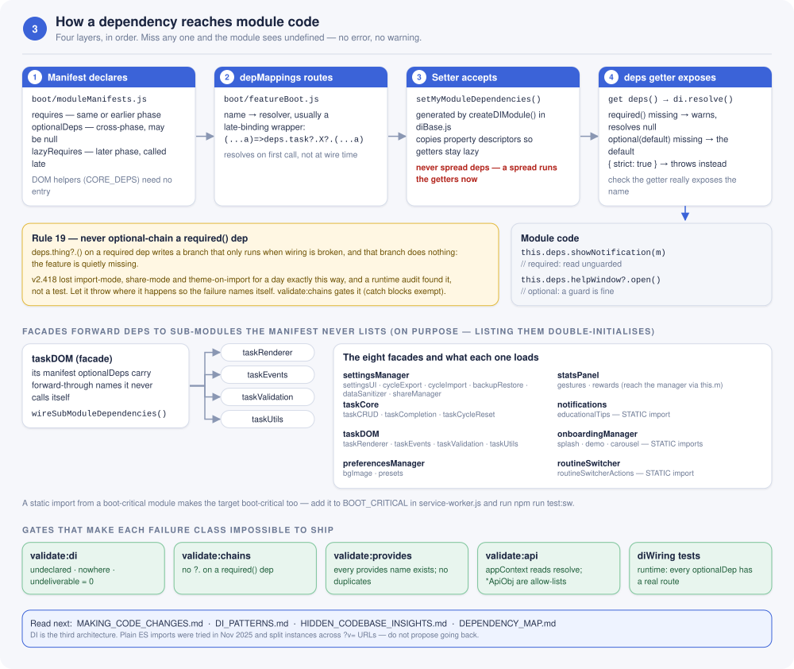
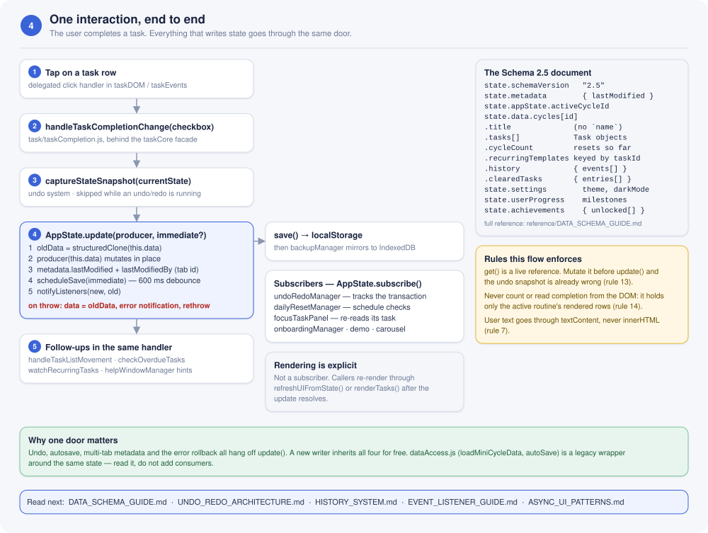
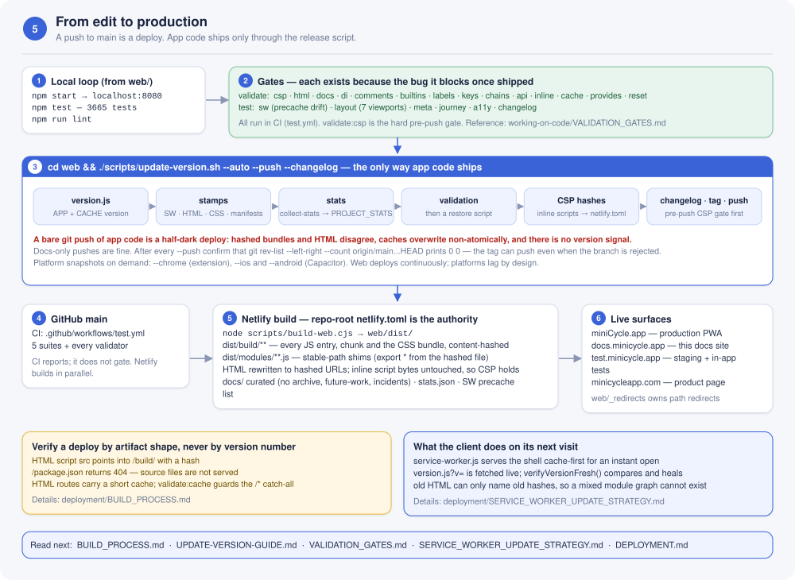

# Codebase Visual Map

> **Purpose:** the whole codebase on five diagrams. Read this first, then follow the "Read next" pointers under each diagram into the detailed guides.
>
> **Added:** September 14, 2026 (v2.560). Counts on the diagrams are from that version; live numbers are in [PROJECT_STATS.md](../PROJECT_STATS.md).

miniCycle is a **routine manager**, not a todo app. Tasks are completed, reset, and completed again, and that single idea shapes the data (`cycleCount`, `recurringTemplates`, `clearedTasks`), the boot sequence, and the rules in the root `CLAUDE.md`. The five maps below go from the outside in: what loads, how it boots, how modules get their dependencies, how one interaction changes state, and how a change reaches production.

---

## 1. Layers — from the HTML head to persistence



**What to notice**

- The `<head>` of `miniCycle.html` is an ordered gauntlet. Everything above the feature gate is ES5 only, because a script block is parsed in full before any of it runs. The gate runs last, alone in its own block, and sends old devices to the frozen `lite/` build.
- One entrypoint, `miniCycle-main.js`, imports the orchestrator and nothing else.
- All dependency wiring happens in Phase 2. Phases 1 and 3 never touch `moduleManifests.js`.
- Persistence is one Schema 2.5 document. `AppState.get()` returns a live reference; `AppState.update()` is the only write path.

**Read next:** [ARCHITECTURE_OVERVIEW.md](ARCHITECTURE_OVERVIEW.md) · [MODULE_SYSTEM_GUIDE.md](MODULE_SYSTEM_GUIDE.md) · [FOLDER_STRUCTURE.md](../start-here/FOLDER_STRUCTURE.md) · [LITE_VERSION.md](LITE_VERSION.md)

---

## 2. Boot sequence — three phases, eight load phases, one lifecycle



**What to notice**

- Each orchestrator phase has its own timeout (values in `core/constants.js`), and two consecutive boot failures clear caches before the retry.
- Inside Phase 2 the loader imports a load phase in parallel, then wires and initialises sequentially. Wiring must happen after same-phase providers have registered, because building the deps object reads every `depMappings` entry eagerly.
- The per-module lifecycle is import → build deps → `setXDependencies()` → `init()` → `registerProvides()`. A facade's `init()` is where its hidden sub-modules load.
- **Core-ready is not state-ready.** After `waitForCore()` a first-run user still has `data = null`, so `get()` returns null and `update()` is a no-op until the first-run screen persists a routine. Do not fix this by making `waitForCore()` await `isReady()`; it deadlocks boot.

**Read next:** [MODULE_LOADER_GUIDE.md](MODULE_LOADER_GUIDE.md) · [APPINIT_EXPLAINED.md](APPINIT_EXPLAINED.md) · [APPINIT_SYSTEM.md](APPINIT_SYSTEM.md) · [ERROR_RECOVERY.md](../working-on-code/ERROR_RECOVERY.md)

---

## 3. Dependency injection — the four-step pipeline



**What to notice**

- A dependency passes through four layers before module code can call it: the manifest declares it, `depMappings` in `featureBoot.js` routes it, the module's setter accepts it with `Object.defineProperties`, and the module's `deps` getter exposes it. Missing any one layer produces a silent `undefined`, not an error.
- `ENFORCE_REQUIRES` is on, so the loader delivers only what a manifest declares. That is why facades carry "forward-through" names in `optionalDeps` for sub-modules that are deliberately not in the manifest.
- Rule 19: read a `required()` dep unguarded. Optional chaining on it writes a branch that only runs when wiring is broken, and that branch silently drops the feature.
- DI is the third architecture this codebase has had. Plain ES imports were tried in November 2025 and failed on `?v=` instance splitting and boot order. Do not propose going back.

**Read next:** [MAKING_CODE_CHANGES.md](../working-on-code/MAKING_CODE_CHANGES.md) · [DI_PATTERNS.md](../working-on-code/DI_PATTERNS.md) · [HIDDEN_CODEBASE_INSIGHTS.md](../working-on-code/HIDDEN_CODEBASE_INSIGHTS.md) · [DEPENDENCY_MAP.md](DEPENDENCY_MAP.md) · [TASKDOM_DI_GUIDE.md](../reference/TASKDOM_DI_GUIDE.md)

---

## 4. State flow — one task completion, end to end



**What to notice**

- The undo snapshot is captured **before** `AppState.update()` runs the producer. Mutating the live reference returned by `get()` ahead of that call poisons the snapshot, so Undo restores the wrong thing (rule 13).
- `update()` clones the old data, runs the producer in place, stamps metadata, debounces a save for 600 ms (or saves immediately when asked), and notifies subscribers. On a throw it rolls back to the clone.
- Rendering is not a subscriber. Callers re-render explicitly through `refreshUIFromState()` or `renderTasks()`. Never derive counts or completion from the DOM (rule 14).
- `dataAccess.js` is a legacy wrapper around the same state. Do not add new consumers.

**Read next:** [DATA_SCHEMA_GUIDE.md](../reference/DATA_SCHEMA_GUIDE.md) · [UNDO_REDO_ARCHITECTURE.md](UNDO_REDO_ARCHITECTURE.md) · [HISTORY_SYSTEM.md](HISTORY_SYSTEM.md) · [EVENT_FLOW_PATTERNS.md](EVENT_FLOW_PATTERNS.md) · [EVENT_LISTENER_GUIDE.md](../working-on-code/EVENT_LISTENER_GUIDE.md) · [ASYNC_UI_PATTERNS.md](../working-on-code/ASYNC_UI_PATTERNS.md)

---

## 5. Shipping — from edit to production



**What to notice**

- A push to `main` is a production deploy. App code ships only through `update-version.sh`, which bumps the version, regenerates the CSP hashes, updates the stats, tags, and pushes. A bare `git push` of app code produces a half-dark deploy.
- The repo-root `netlify.toml` is the build authority. The build content-hashes every JS entry, chunk, and the CSS bundle under `dist/build/`, so old HTML can only name old hashes and a mixed module graph cannot exist.
- Verify a deploy by artifact shape, not by version number: script tags point into `/build/` and `/package.json` returns 404.
- Every gate on the diagram exists because the bug it blocks once shipped. Read a gate's one-line rationale in the root `CLAUDE.md` before deciding it is in your way.

**Read next:** [BUILD_PROCESS.md](../deployment/BUILD_PROCESS.md) · [UPDATE-VERSION-GUIDE.md](../deployment/UPDATE-VERSION-GUIDE.md) · [VALIDATION_GATES.md](../working-on-code/VALIDATION_GATES.md) · [SERVICE_WORKER_UPDATE_STRATEGY.md](../deployment/SERVICE_WORKER_UPDATE_STRATEGY.md) · [DEPLOYMENT.md](../deployment/DEPLOYMENT.md)

---

## Maintaining these diagrams

The diagrams are generated SVG files in `architecture/diagrams/`, produced by `web/scripts/build-visual-map.py` (stdlib only, like the `validate-*.py` scripts):

```bash
cd web && python3 scripts/build-visual-map.py
```

- They are plain SVG on purpose. The docs site is self-hosted Docsify behind a `script-src 'self'` CSP with no Mermaid plugin, so a ` ```mermaid ` fence renders as raw text on docs.minicycle.app. SVG images render there, on GitHub, and in any editor.
- The generator measures every string against a font width table, wraps text inside its card, and sizes each card from its content, so a wording change cannot push text outside a box. Edit the diagram functions at the bottom of the script, re-run it, and reload this page.
- Each SVG paints its own opaque light background so it stays legible on the dark docs theme, and each carries a `<title>` that doubles as its accessible name.
- `npm run validate:docs` checks that every image path here resolves and is git-tracked.

When a count on a diagram drifts from [PROJECT_STATS.md](../PROJECT_STATS.md), update the string in the generator; the stats file is the source of truth.
