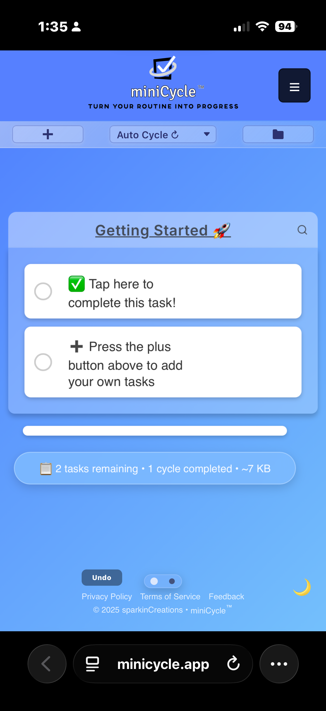
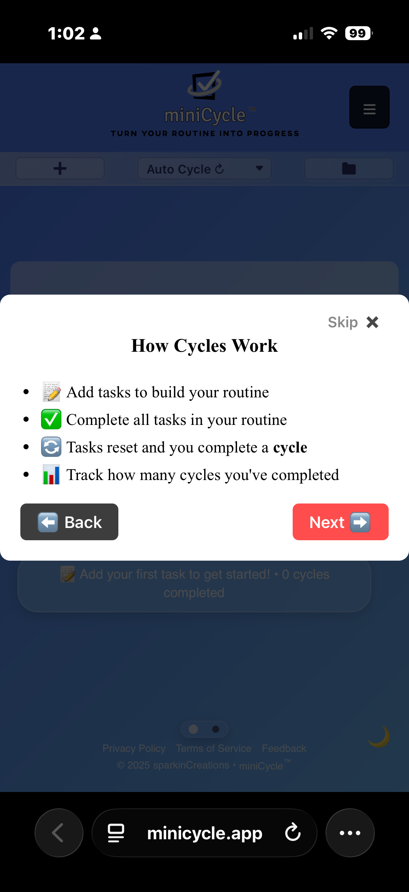
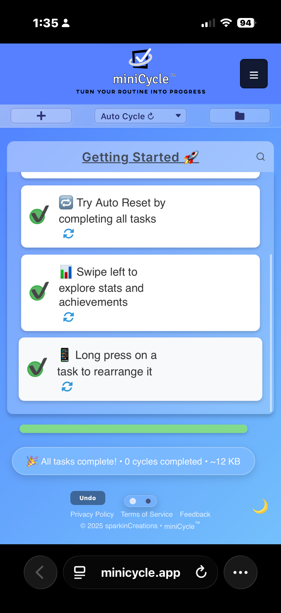
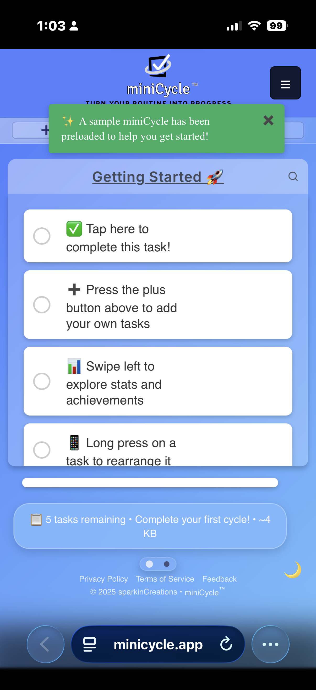
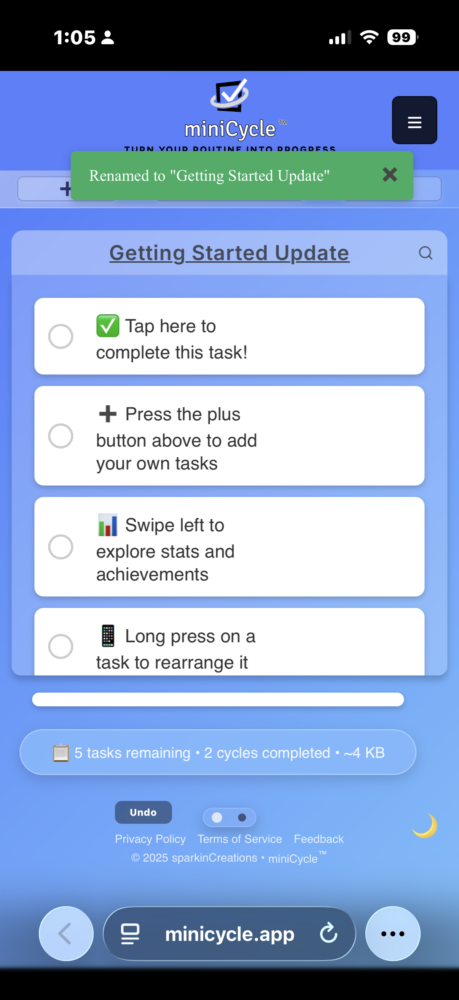
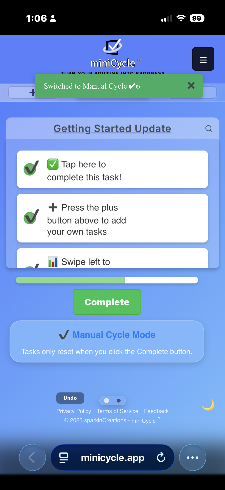
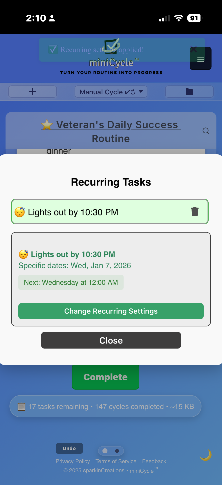
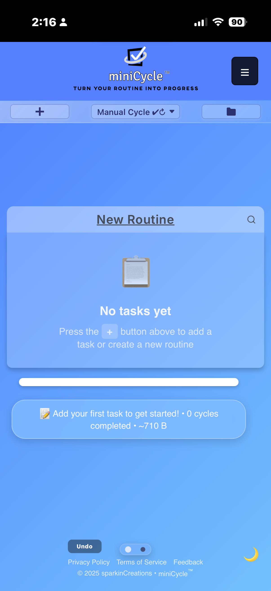

# ✨ What is miniCycle?

**Your Routine Manager That Resets Itself**



-----

## 🎯 The Simple Explanation

miniCycle is a routine manager.

You create **routines** made of tasks, complete them, and when all tasks are finished, miniCycle automatically resets the routine so it's ready for next time.

It also tracks how many times you've completed each routine — these completions are your **cycles**.

Think of it like a checklist that never disappears and never needs rebuilding.

-----

## 🔁 How miniCycle Works (Super Simple)

### 1️⃣ You create a routine

Examples:

- Morning Routine
- Daily Inspection
- Cleaning Checklist
- Weekly Planning
- Gym Workout

### 2️⃣ You add tasks inside the routine

Examples:

- Make coffee
- Check email
- Stretch
- Review schedule

### 3️⃣ You complete all the tasks

When you check off the final task…



### 4️⃣ miniCycle resets the routine

All tasks become unchecked again — ready for next time.



### 5️⃣ Your Cycle Count increases

Every completed routine adds **+1 cycle** to your progress.

-----

## 🔄 Understanding "Routines" vs "Cycles"

### What's a Routine?

A **routine** is the persistent checklist you create.

Examples:

- Your "Morning Routine" with 8 tasks
- Your "Quality Check" routine with 12 steps
- Your "Weekly Review" routine with 5 items

**The routine stays the same.** You create it once, and it never disappears.

### What's a Cycle?

A **cycle** is one complete run-through of your routine.

Examples:

- Complete your Morning Routine → **1 cycle**
- Complete it again tomorrow → **2 cycles**
- Complete it 30 days in a row → **30 cycles**

**The cycle count tracks your consistency.** It shows how many times you've finished the entire routine.

### The Relationship

```
You CREATE routines
You COMPLETE cycles

Routine = The thing you build (permanent)
Cycle = Each time you finish it (tracked progress)
```

**In one sentence:**
"I created my Morning Routine, and I've completed 42 cycles of it this month."

-----

## 🧠 The Core Idea

**Complete all tasks → tasks reset → cycle count goes up.**

That's it. Simple. Predictable. Repeatable.

-----

## 📈 What Is a "Cycle"? (Deeper Dive)

A cycle is one full completion of your routine.

### Real-World Example:

**Morning Routine:**

```
[ ] Wake up at 6 AM
[ ] Drink water
[ ] Exercise 20 minutes
[ ] Shower
[ ] Make breakfast
[ ] Review today's goals
```

**First day:** Check all 6 tasks → **Cycle count: 1**
**Second day:** Check all 6 tasks → **Cycle count: 2**
**Third day:** Check all 6 tasks → **Cycle count: 3**

After a month: **Cycle count: 30** (if you completed it every day)

### Why Cycle Counts Matter

- **Track consistency** - See how often you actually complete routines
- **Build momentum** - Higher numbers = more motivation
- **Spot patterns** - Know which routines you're maintaining vs. skipping
- **Unlock achievements** - Reach milestones (5, 25, 50, 75, 100 cycles!)



Every routine has its own cycle count.

-----

## 🎛️ Three Modes for Different Needs

miniCycle offers three different ways routines can behave:



### 🔄 Auto Cycle Mode (Most Popular)

**How it works:**

- Check off the last task
- Brief celebration moment
- Routine automatically resets
- Cycle count increases

**Perfect for:**

- Daily routines you do often
- Work checklists that repeat continuously
- Any routine where completion = ready to start again

**Example:** Quality inspection checklist that runs all day long

-----

### ✋ Manual Cycle Mode

**How it works:**

- Complete all tasks
- "Complete" button appears
- You click when ready to reset
- Tasks uncheck and cycle count increases



**Perfect for:**

- Weekly or monthly routines
- Routines with tasks spread over time
- When you want to review before resetting

**Example:** Weekly planning checklist you complete over several days

-----

### ✅ To-Do Mode

**How it works:**

- Complete a task → it gets deleted (not reset)
- Works like a traditional to-do list
- No cycling — tasks are removed when done

**Perfect for:**

- One-time tasks
- Shopping lists
- Project deliverables
- Anything you don't want to repeat

**Example:** Moving checklist or vacation planning

-----

## 🧱 Real-World Examples

### ⭐ Personal Routines

**Morning Routine** (Auto Cycle)

```
☀️ Morning Routine — 47 cycles completed
[ ] Wake up by 6:30 AM
[ ] Drink 16oz water
[ ] 20-minute workout
[ ] Shower & get dressed
[ ] Healthy breakfast
[ ] Review daily goals
```

→ Resets automatically every morning

-----

**Evening Wind-Down** (Manual Cycle)

```
🌙 Evening Wind-Down — 23 cycles completed
[ ] Prep tomorrow's outfit
[ ] Pack lunch for tomorrow
[ ] Tidy living room (10 min)
[ ] Skincare routine
[ ] Read for 30 minutes
[ ] Lights out by 10 PM
```

→ You control when to reset

-----

### ⭐ Work Routines

**Quality Inspection** (Auto Cycle)

```
🔍 Part Inspection — 284 cycles completed
[ ] Check part number (High Priority)
[ ] Check job number (High Priority)
[ ] Verify serial number
[ ] Measure dimensions
[ ] Visual inspection
[ ] Log in system
```

→ Resets instantly for next part

-----

**Weekly Report** (Manual Cycle)

```
📊 Weekly Reports — 12 cycles completed
[ ] Compile production data (Due Monday)
[ ] Submit timesheet (Due Wednesday)
[ ] Update project status (Due Friday)
[ ] Plan next week's priorities (Due Friday)
```

→ Reset manually each Friday evening

-----

### ⭐ Power User Example

Here's what consistent use looks like — **147 cycles completed**:



-----

### ⭐ Planning Routines

**Weekly Review** (Manual Cycle)

```
📝 Weekly Planning — 35 cycles completed
[ ] Review last week's wins
[ ] Identify what didn't work
[ ] Set 3 priorities for this week
[ ] Schedule important tasks
[ ] Clear inbox to zero
```

→ Complete on Sunday, reset for next week

-----

### ⭐ One-Time Projects

**House Move** (To-Do Mode)

```
📦 Moving Checklist
[ ] Hire moving company
[ ] Pack kitchen
[ ] Transfer utilities
[ ] Update mailing address
[ ] Pack bedroom
```

→ Tasks delete when done (no cycling)

-----

## 🔥 Why miniCycle Helps You Stay Consistent

### ✔ You never rebuild your routines

Your routine stays exactly the same every time.

No more "What did I do yesterday?" or "What's my morning routine again?"

### ✔ You always start fresh

After completion, everything resets to a clean slate.

No lingering completed tasks. No clutter. Just a fresh start.

### ✔ You track real progress

Cycle counts show consistency, not just good intentions.

42 cycles = you actually did the thing 42 times.

### ✔ You build momentum

Watching cycle counts increase feels good.

Each completion reinforces the routine.

### ✔ You maintain routine stability

Same steps every time = less chance of missing something important.

Especially valuable for work procedures or safety checklists.

-----

## 📚 The miniCycle Advantage

### ✨ Persistent Routines

Your routines stay the same every day, week, or month.

### 🔄 Auto-Reset on Completion

No extra effort — it resets automatically (in Auto Cycle mode).

### 📊 Cycle Count Tracking

See exactly how many times you've completed each routine.

### 🎛️ Flexible Modes

Auto Cycle, Manual Cycle, or To-Do Mode for different needs.

### 🧠 Lower Mental Load

No need to remember or recreate — the routine resets for you.

### 🔧 Feels Like a System

Designed for repeatable workflows, not one-off tasks.

### 🔒 Privacy-First

No accounts, no cloud sync. All data stays on your device.

### 📱 Works Offline

Progressive Web App (PWA) works without internet.

-----

## 🆚 How miniCycle Compares

### Traditional To-Do Apps (Todoist, Any.do, etc.)

❌ Tasks disappear when completed
❌ Must rebuild routines constantly
❌ No cycling concept
✅ Good for one-off projects

-----

### Habit Trackers (Habitica, Streaks, etc.)

❌ Only track completion, don't manage tasks
❌ No complex workflows
❌ Limited task details
✅ Good for simple habit building

-----

### miniCycle

✅ **Persistent routines** that don't disappear
✅ **Complex workflows** with multiple tasks
✅ **Flexible cycling** modes for different needs
✅ **Full task management** within routine structure
✅ **Time-based features** (recurring, due dates, notifications)
✅ **Customizable interface** (show/hide task option buttons per cycle)
✅ **Privacy-focused** (local storage only)
✅ **Works offline** (PWA)

-----

## 🎯 Who Should Use miniCycle?

### ✅ Perfect For:

- **Routine-oriented people** who repeat the same tasks regularly
- **Process followers** who have checklists or procedures
- **Routine builders** establishing new routines
- **Manufacturing/quality control** workers with inspection checklists
- **Healthcare workers** with protocols and procedures
- **Service workers** with opening/closing routines
- **Anyone tired of rebuilding the same to-do list** over and over

### ⚠️ Not Ideal For:

- **Only have one-off tasks** (traditional to-do apps work better)
- **Don't repeat workflows** (no benefit from cycling)
- **Need cloud sync** (miniCycle is local-only for privacy)
- **Want team collaboration** (miniCycle is for personal use)

-----

## 🚀 Getting Started

### Step 1: Identify Your Routines

Think about tasks you do repeatedly:

- Daily morning/evening routines
- Work procedures
- Weekly planning sessions
- Cleaning schedules
- Workout programs
- Monthly reviews

### Step 2: Choose the Right Mode

- **Auto Cycle** - For routines that immediately repeat (daily routines)
- **Manual Cycle** - For routines you control timing (weekly reviews)
- **To-Do** - For one-off tasks mixed in (projects)

### Step 3: Create Your First Routine



1. Open miniCycle
1. Click "Create a Routine"
1. Name it (e.g., "Morning Routine")
1. Add your tasks
1. Choose your mode (Auto/Manual/To-Do)

### Step 4: Start Cycling

- Complete tasks as you do them
- Watch the routine reset when finished
- See your cycle count increase
- Build consistency over time

-----

## 💡 Key Insights

### 🔄 The Routine is the Product

You're not just managing tasks.

You're building and refining repeatable routines.

Each cycle helps you improve your process.

### 🎯 Completion ≠ Deletion

Completing tasks shows progress.

Resetting maintains routine structure.

Both actions are valuable and separate.

### 🛠️ Flexibility is Power

Different modes for different needs.

Mix cycling with traditional tasks.

Adapt to your actual workflow.

-----

## 🏆 The Bottom Line

**miniCycle turns task management into routine management.**

Instead of constantly rebuilding task lists, you build **persistent routines** that get better over time.

You maintain **process consistency** while tracking **completion progress** through cycle counts.

**Result:** More efficient routines, less mental overhead.

-----

## 🚀 In One Final Sentence

miniCycle is a routine manager that resets tasks automatically when you finish the routine and counts every completed cycle — helping you stay consistent every day.

-----

**miniCycle: Turn Your Routine Into Progress** 🔄

-----

**Ready to start?** Visit [minicycleapp.com](https://minicycleapp.com)

**Questions?** Check out the [User Guide](USER_GUIDE.md) or [FAQ](FAQ.md)

**For Developers:** See [Developer Documentation](../developer-guides/DEVELOPER_DOCUMENTATION.md)
